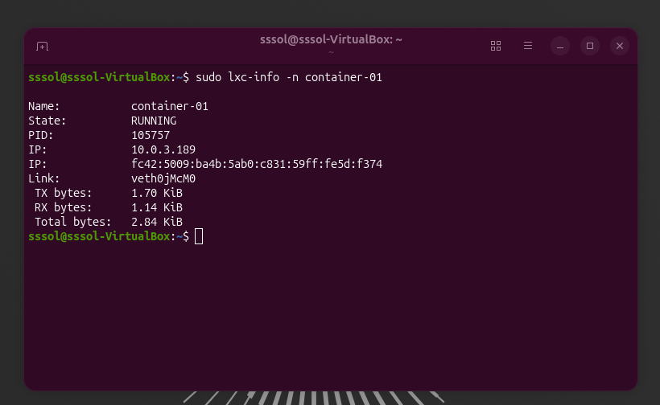
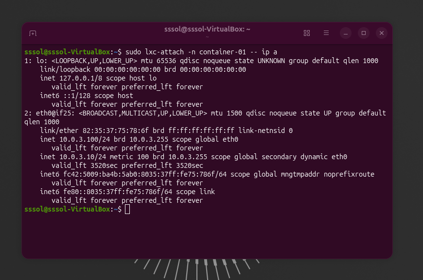
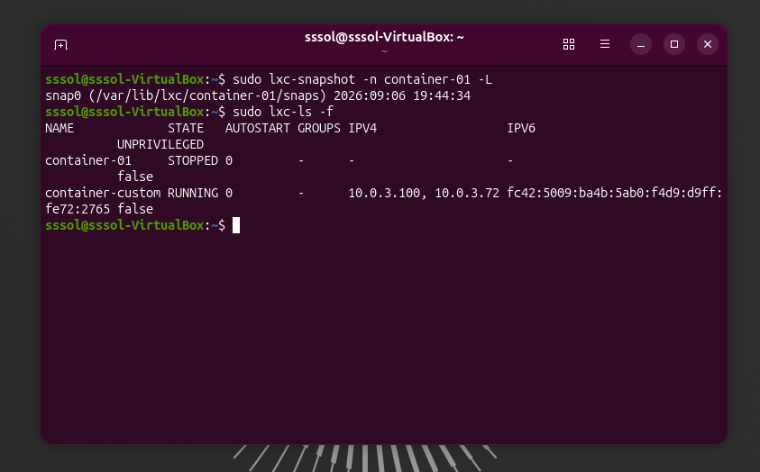
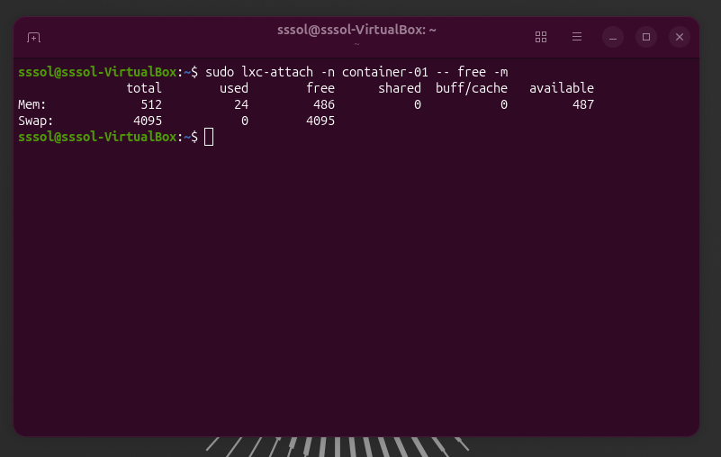
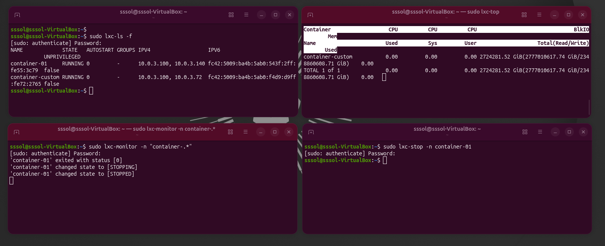
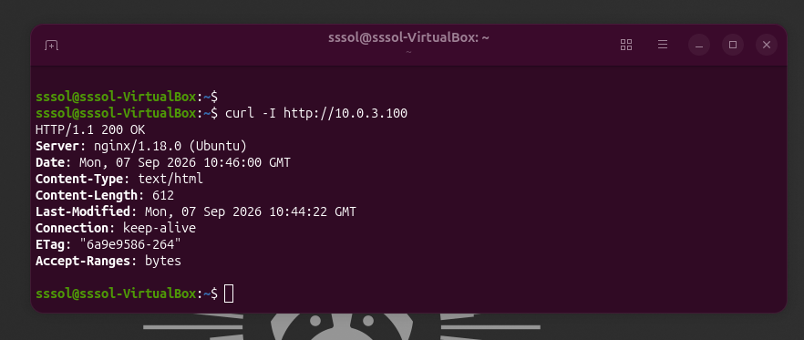
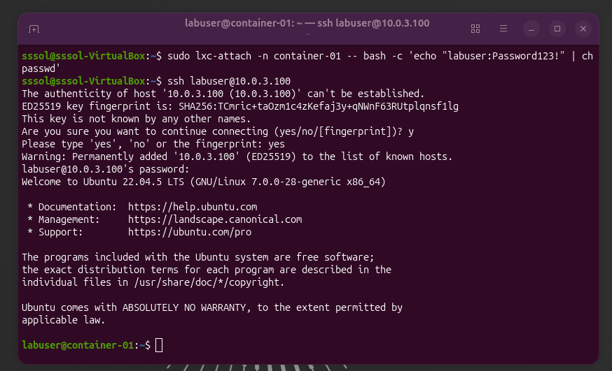
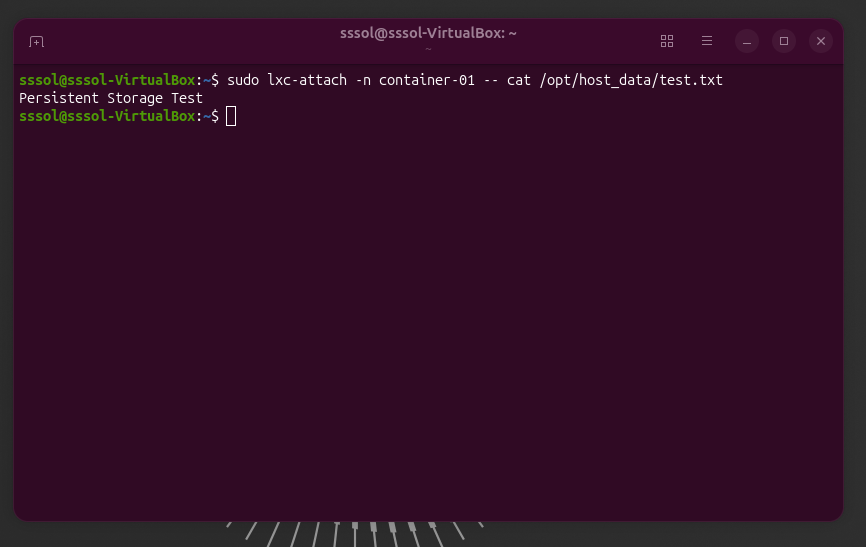
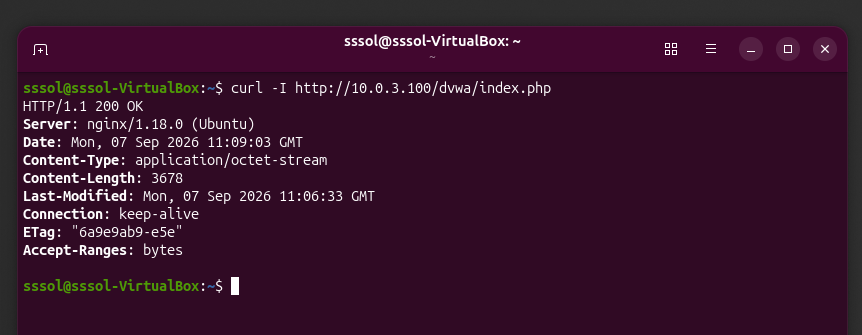

# lxc-lab-portfolio
Practical LXC container management lab on Ubuntu 26.04 LTS

LXC Lab Portfolio: Hands-On Container Management

This portfolio demonstrates practical containerization concepts using LXC (Linux Containers) on Ubuntu 26.04 LTS inside a VirtualBox environment.

Task 1: Installation and First Container

Goal: Install LXC tools and initialize a basic unprivileged container.

Commands:
```bash
sudo apt update && sudo apt install -y lxc lxc-templates bridge-utils
lxc-create -n container-01 -t download -- -d ubuntu -r noble -a amd64
lxc-start -n container-01
lxc-info -n container-01

Installed LXC package dependencies on Ubuntu 26.04 LTS. Downloaded the official Ubuntu rootfs template and created an unprivileged container named container-01. Verified operational status using lxc-info.



Task 2: Network Configuration

Goal: Configure static networking on the `lxcbr0` virtual bridge interface for the LXC container.

Commands:
```bash
# 1. Edit the container configuration file
sudo nano /var/lib/lxc/container-01/config

# Add/modify the following lines:
# lxc.net.0.type = veth
# lxc.net.0.flags = up
# lxc.net.0.link = lxcbr0
# lxc.net.0.ipv4.address = 10.0.3.100/24
# lxc.net.0.ipv4.gateway = 10.0.3.1

# 2. Restart the container to apply network settings
sudo lxc-stop -n container-01
sudo lxc-start -n container-01

# 3. Verify the assigned IP address
sudo lxc-attach -n container-01 -- ip a

Modified the container configuration file to assign a static IP address (10.0.3.100) on the default lxcbr0 virtual bridge interface. Confirmed network connectivity using ip a via lxc-attach.



Task 3: Custom LXC Image Creation

Goal: Customize a running container and create a reusable template/image.

Commands:
```bash
sudo lxc-attach -n container-01 -- sh -c "apt update && apt install -y curl vim"
sudo lxc-stop -n container-01
sudo lxc-snapshot -n container-01 -L
sudo lxc-copy -n container-01 -N container-custom -s snap0
sudo lxc-start -n container-custom

Provisioned base tools (curl, vim) inside container-01. Created a filesystem snapshot named custom-template and cloned it to launch a pre-configured instance (container-custom).



Task 4: Resource Limits Management

Goal: Restrict CPU cores and RAM usage using Control Groups (cgroups).

Commands:
```bash
sudo nano /var/lib/lxc/container-01/config
# Append cgroup limits:
# lxc.cgroup2.memory.max = 512M
# lxc.cgroup2.cpu.max = 100000 200000

sudo lxc-stop -n container-01
sudo lxc-start -n container-01
sudo cat /sys/fs/cgroup/lxc.payload.container-01/memory.max
sudo cat /sys/fs/cgroup/lxc.payload.container-01/cpu.max
sudo lxc-attach -n container-01 -- df -h /
sudo lxc-attach -n container-01 -- free -m

Enforced hardware resource constraints using Cgroups v2. Restricted memory allocation to 512MB and limited CPU quota to 50% of a single core.



Task 5: LXC Command Line Toolset Exploration

Goal: Demonstrate core management utilities in the LXC ecosystem.

Commands:
```bash
sudo lxc-ls -f
sudo lxc-top
sudo lxc-monitor -n "container-.*"
sudo lxc-stop -n container-01

Utilized lxc-ls -f to inspect active states and IP assignments, monitored real-time system metrics using lxc-top, and observed lifecycle events via lxc-monitor.



Task 6: Deploying a Web Server (Nginx)

Goal: Spin up a web server inside a isolated LXC environment.

Commands:
```bash
sudo lxc-attach -n container-01 -- apt update && apt install -y nginx
sudo lxc-attach -n container-01 -- systemctl enable --now nginx
curl -I http://10.0.3.100

Deployed an Nginx web server inside container-01. Verified HTTP response headers from the host environment to confirm port binding and application readiness.



Task 7: SSH Access Configuration

Goal: Configure secure remote access directly into the LXC container.

Commands:
```bash
sudo lxc-attach -n container-01 -- apt update
sudo lxc-attach -n container-01 -- apt install -y openssh-server
sudo lxc-attach -n container-01 -- bash -c "echo 'labuser:Password123\!' | chpasswd"
ssh labuser@10.0.3.100

Configured OpenSSH daemon on the target container, created dedicated non-root credentials, and established a direct SSH session from the VirtualBox host machine.



Task 8: Data Persistence and Bind Mounts

Goal: Mount host directories inside the container to preserve data across destructions.

Commands:
```bash
mkdir -p /home/user/lxc-data
echo "Persistent Storage Test" > /home/user/lxc-data/test.txt
sudo nano /var/lib/lxc/container-01/config

# Add bind mount entry:
  lxc.mount.entry = /home/user/lxc-data opt/host_data none bind,create=dir 0 0

sudo lxc-stop -n container-01
sudo lxc-start -n container-01
sudo lxc-attach -n container-01 -- cat /opt/host_data/test.txt

Configured host-to-container bind mounting to decouple storage from the container lifecycle. Verified data persistence across container state reboots.



Task 9: Vulnerability Testing Sandbox

Goal: Isolate and test potentially unsafe software inside a sandbox environment.

Commands:
```bash
sudo lxc-attach -n container-01 -- apt update
sudo lxc-attach -n container-01 -- apt install -y python3 git
sudo lxc-attach -n container-01 -- git clone https://github.com/digininja/DVWA /var/www/html/dvwa
sudo lxc-info -n container-01
curl -I [http://10.0.3.100/dvwa/index.php](http://10.0.3.100/dvwa/index.php)

Utilized LXC isolation properties to safely deploy an intentionally vulnerable application (DVWA) for security analysis, preventing exposure to the host system.


