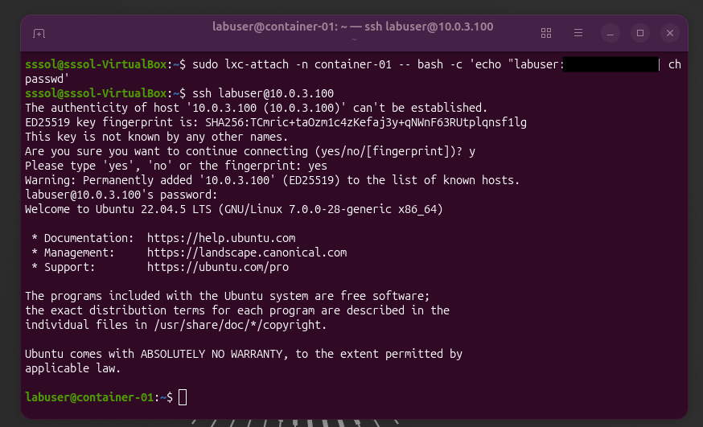

# LXC Container Management Lab

A hands-on Linux containerization lab demonstrating LXC deployment, networking, resource management, service configuration, persistent storage, monitoring, and isolated security testing.

## Technologies

- Ubuntu 26.04 LTS
- LXC / LXC tools
- VirtualBox
- Linux networking and `lxcbr0`
- cgroups v2
- Nginx
- OpenSSH
- DVWA
- Bash

## Objectives

This project demonstrates:

- LXC container creation and lifecycle management
- Static network configuration
- Container snapshots and cloning
- CPU and memory resource limits
- Container monitoring
- Nginx deployment
- SSH configuration
- Persistent storage using bind mounts
- Isolated vulnerability testing with DVWA

## Lab Environment

| Component | Configuration |
|---|---|
| Host environment | VirtualBox |
| Host OS | Ubuntu 26.04 LTS |
| Container runtime | LXC |
| Container OS | Ubuntu 24.04 LTS (Noble), amd64 |
| Container IP | 10.0.3.100 |
| Network bridge | lxcbr0 |
| Memory limit | 512 MB |
| CPU quota | 50% of one CPU |

---

### Task 1: Installation and First Container

**Goal:** Install LXC tools and initialize a basic unprivileged container.

**Commands:**

```bash
sudo apt update && sudo apt install -y lxc lxc-templates bridge-utils
lxc-create -n container-01 -t download -- -d ubuntu -r noble -a amd64
lxc-start -n container-01
lxc-info -n container-01
```
Installed LXC package dependencies on Ubuntu 26.04 LTS. Downloaded the official Ubuntu rootfs template and created an LXC container named `container-01`. Verified operational status using `lxc-info`.


### Task 2: Network Configuration

**Goal:** Configure static networking on the `lxcbr0` virtual bridge interface for the LXC container.

**Commands:**

```bash
# Edit the container configuration
sudo nano /var/lib/lxc/container-01/config

# Add/modify:
lxc.net.0.type = veth
lxc.net.0.flags = up
lxc.net.0.link = lxcbr0
lxc.net.0.ipv4.address = 10.0.3.100/24
lxc.net.0.ipv4.gateway = 10.0.3.1

# Restart the container
sudo lxc-stop -n container-01
sudo lxc-start -n container-01

# Verify the IP address
sudo lxc-attach -n container-01 -- ip a
```

Modified the container configuration file to assign a static IP address (`10.0.3.100`) on the default `lxcbr0` virtual bridge interface. Confirmed the assigned IP address using `ip a` via `lxc-attach`.


### Task 3: Custom LXC Image Creation

**Goal:** Customize a running container, create a filesystem snapshot, and use the snapshot to create a reusable clone.

**Commands:**
```bash
# Install additional tools inside the container
sudo lxc-attach -n container-01 -- sh -c "apt update && apt install -y curl vim"

# Stop the container before creating the snapshot
sudo lxc-stop -n container-01

# Create a snapshot named snap0
sudo lxc-snapshot -n container-01

# List available snapshots
sudo lxc-snapshot -n container-01 -L

# Create a new container from the snapshot
sudo lxc-copy -n container-01 -N container-custom -s snap0

# Start the cloned container
sudo lxc-start -n container-custom
```
Provisioned base tools (curl and vim) inside container-01. Created a filesystem snapshot and used it as the source for a cloned container named container-custom. The cloned container was then started successfully.


### Task 4: Resource Limits Management

**Goal:** Restrict CPU cores and RAM usage using Control Groups (cgroups).

**Commands:**
```bash
 # Edit the container configuration file
sudo nano /var/lib/lxc/container-01/config

Append cgroup limits:
lxc.cgroup2.memory.max = 512M
lxc.cgroup2.cpu.max = 100000 200000

sudo lxc-stop -n container-01
sudo lxc-start -n container-01
sudo cat /sys/fs/cgroup/lxc.payload.container-01/memory.max
sudo cat /sys/fs/cgroup/lxc.payload.container-01/cpu.max
sudo lxc-attach -n container-01 -- df -h /
sudo lxc-attach -n container-01 -- free -m
```
Enforced resource limits using cgroups v2. The container's maximum memory usage was restricted to 512 MB, while the CPU quota was limited to 50% of a single CPU core.


### Task 5: LXC Command Line Toolset Exploration

**Goal:** Demonstrate core management utilities in the LXC ecosystem.

**Commands:**
```bash
sudo lxc-ls -f
sudo lxc-top
sudo lxc-monitor -n "container-.*"
sudo lxc-stop -n container-01
```
Utilized `lxc-ls -f` to inspect active states and IP assignments, monitored real-time system metrics using `lxc-top`, and observed lifecycle events via `lxc-monitor`.


### Task 6: Deploying a Web Server (Nginx)

**Goal:** Spin up a web server inside an isolated LXC environment.

**Commands:**
```bash
sudo lxc-attach -n container-01 -- sh -c "apt update && apt install -y nginx"
sudo lxc-attach -n container-01 -- systemctl enable --now nginx
curl -I http://10.0.3.100
```
Deployed an Nginx web server inside container-01. Verified HTTP response headers from the host environment to confirm port binding and application readiness.


### Task 7: SSH Access Configuration

> **Security note:** The password `<LAB_PASSWORD>` was used only for demonstration purposes in the isolated laboratory environment. In a production environment, a strong unique password or SSH key-based authentication should be used instead.

**Goal:** Configure secure remote access directly into the LXC container.

**Commands:**
```bash
sudo lxc-attach -n container-01 -- apt update
sudo lxc-attach -n container-01 -- apt install -y openssh-server
sudo lxc-attach -n container-01 -- bash -c "echo 'labuser:<LAB_PASSWORD>' | chpasswd"
ssh labuser@10.0.3.100

```
Configured OpenSSH daemon on the target container, created dedicated non-root credentials, and established a direct SSH session from the VirtualBox host machine.



### Task 8: Data Persistence and Bind Mounts

**Goal:** Mount a host directory inside the container to preserve data independently of the container lifecycle.

**Commands:**
```bash
mkdir -p /home/user/lxc-data
echo "Persistent Storage Test" > /home/user/lxc-data/test.txt

# Edit /var/lib/lxc/container-01/config
sudo nano /var/lib/lxc/container-01/config

# Add the following bind mount entry:
lxc.mount.entry = /home/user/lxc-data opt/host_data none bind,create=dir 0 0

# Restart the container to apply the configuration
sudo lxc-stop -n container-01
sudo lxc-start -n container-01

# Verify the mounted data
sudo lxc-attach -n container-01 -- cat /opt/host_data/test.txt
```
Configured a host-to-container bind mount to decouple persistent data from the container's filesystem. The data stored in the host directory was successfully accessed from inside the container, demonstrating persistence across container restarts.


### Task 9: Vulnerability Testing Sandbox

**Goal:** Isolate and test potentially unsafe software inside a sandbox environment.

**Commands:**
```bash
sudo lxc-attach -n container-01 -- apt update
sudo lxc-attach -n container-01 -- apt install -y python3 git
sudo lxc-attach -n container-01 -- git clone https://github.com/digininja/DVWA /var/www/html/dvwa
sudo lxc-info -n container-01
curl -I http://10.0.3.100/dvwa/index.php
```
Utilized LXC isolation to deploy an intentionally vulnerable application (DVWA) in a controlled laboratory environment for security analysis, reducing the risk of affecting the host system.


### Conclusion

Throughout this laboratory project, practical experience was gained in installing, configuring, managing, and utilizing LXC containers in an Ubuntu 26.04 LTS virtual environment. The laboratory activities covered the complete container lifecycle, starting with the creation and initialization of an LXC container and continuing with network configuration, resource management, container snapshots, and cloning.

A static IP address was configured using the lxcbr0 virtual bridge, while cgroups v2 were used to limit the container's memory and CPU resources. The LXC command-line utilities were also explored to monitor container status, resource usage, and lifecycle events.

The project also demonstrated how LXC containers can be used to host real services. An Nginx web server was deployed and tested inside the container, and SSH access was configured using a dedicated non-root user. Host-to-container bind mounts were implemented to provide persistent data storage independently of the container's lifecycle.

Finally, the container was used as an isolated security testing environment for deploying DVWA, an intentionally vulnerable web application. This demonstrated how containerization can be useful for security research and testing while reducing the risk of directly affecting the host operating system.

Overall, this laboratory provided a practical understanding of Linux containerization and LXC administration. The completed tasks demonstrated essential skills in container deployment, networking, resource control, service configuration, data persistence, monitoring, and security testing. These skills provide a solid foundation for working with containerized Linux environments and more advanced virtualization and infrastructure technologies.
